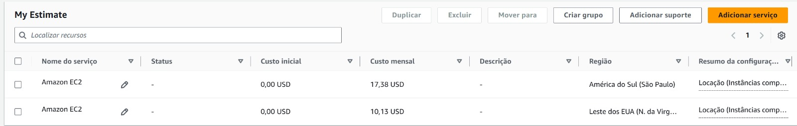

# FarmTech Solutions — Análise de Rendimento de Safras

> **FIAP — Pós-graduação em IA | Fase 5 — Entrega 1**

Projeto de Machine Learning aplicado à agricultura de precisão. Desenvolvido para uma fazenda de médio porte (~200 hectares), o trabalho analisa condições climáticas e prevê o rendimento de quatro culturas utilizando técnicas de ML supervisionado e não supervisionado.

---

## Demonstração em Vídeo

> **[▶ Assista no YouTube](https://www.youtube.com/watch?v=unjhzXkv4LI)**
https://www.youtube.com/watch?v=unjhzXkv4LI
---

## Problema e Contexto

A fazenda produz quatro culturas tropicais e precisa de uma solução de IA capaz de:

1. **Entender o comportamento histórico** das safras em diferentes condições climáticas
2. **Agrupar padrões de produtividade** e sinalizar safras atípicas (outliers)
3. **Prever o rendimento futuro** a partir de variáveis ambientais mensuráveis

---

## Dataset — `crop_yield.csv`

| Variável | Descrição |
|---|---|
| `Crop` | Tipo de cultura: *Cocoa beans*, *Oil palm fruit*, *Rice paddy*, *Rubber natural* |
| `Precipitation (mm day-1)` | Precipitação média diária (mm) |
| `Specific Humidity at 2 Meters (g/kg)` | Umidade específica a 2 m acima do solo |
| `Relative Humidity at 2 Meters (%)` | Umidade relativa a 2 m acima do solo |
| `Temperature at 2 Meters (C)` | Temperatura a 2 m acima do solo (°C) |
| `Yield` | **Variável-alvo** — rendimento da safra (hg/ha) |

- **157 registros** · **4 culturas** · **sem valores nulos**

---

## Solução — Notebook Jupyter

Todo o pipeline de análise está documentado e executável no arquivo [`[crop_yield_analysis.ipynb](https://colab.research.google.com/drive/16vXx86gqunnlUFeu3D14WXXm7UQ7mdE6)`](https://colab.research.google.com/drive/16vXx86gqunnlUFeu3D14WXXm7UQ7mdE6).

### Estrutura do Notebook

```
1. Configuração do Ambiente
   └── Importação de bibliotecas

2. Carregamento e Inspeção dos Dados
   └── Shape, tipos, valores nulos, distribuição por cultura

3. Análise Exploratória (EDA)
   ├── Estatísticas descritivas por cultura
   ├── Boxplots de rendimento (identificação visual de outliers)
   └── Matriz de correlação

4. Pré-processamento
   ├── Label Encoding da variável categórica `Crop`
   └── StandardScaler para normalização

5. ML Não Supervisionado — Clusterização K-Means
   ├── Método do Cotovelo (Elbow) + Coeficiente de Silhueta
   ├── K-Means com K=4
   ├── Visualização 2D via PCA
   └── Detecção de outliers por distância ao centróide (P95)

6. ML Supervisionado — 5 Modelos de Regressão
   ├── Divisão treino/teste (80/20, estratificado)
   ├── Linear Regression
   ├── Ridge Regression (regularização L2)
   ├── Decision Tree Regressor
   ├── Random Forest Regressor
   ├── Gradient Boosting Regressor
   ├── Comparação: R², RMSE, MAE
   ├── Gráfico Predito vs. Real
   ├── Importância de Features
   └── Validação Cruzada (5-fold)

7. Conclusões Finais
   └── Achados, pontos fortes e limitações
```

---

## Como Executar

O notebook está disponível diretamente no Google Colab — nenhuma instalação local necessária.

**[▶ Abrir no Google Colab](https://colab.research.google.com/drive/16vXx86gqunnlUFeu3D14WXXm7UQ7mdE6)**
https://colab.research.google.com/drive/16vXx86gqunnlUFeu3D14WXXm7UQ7mdE6
1. Acesse o link acima
2. Faça uma cópia: **Arquivo → Salvar uma cópia no Drive**
3. Certifique-se de que o arquivo `crop_yield.csv` está na pasta raiz do seu Google Drive (ou ajuste o caminho de leitura na célula de carregamento dos dados)
4. Execute: **Runtime → Run all** (ou `Ctrl+F9`)

---

## Principais Resultados

### Clusterização

- K-Means com **K=4** identificou grupos que correspondem às 4 culturas reais sem usar rótulos — Silhouette Score > 0.75
- ~**5% dos registros** foram classificados como outliers (safras com condições climáticas ou rendimentos incomuns)

### Regressão

| Modelo | R² | RMSE | MAE |
|---|---|---|---|
| Linear Regression | ~0.96 | — | — |
| Ridge Regression | ~0.96 | — | — |
| Decision Tree | ~0.96 | — | — |
| **Random Forest** | **~0.99** | — | — |
| **Gradient Boosting** | **~0.99** | — | — |

> *Valores exatos gerados na execução do notebook.*

**Feature mais relevante:** `Crop` (tipo de cultura) — confirma que a espécie cultivada é o principal determinante do rendimento.

---

## Tecnologias Utilizadas

| Biblioteca | Uso |
|---|---|
| `pandas` / `numpy` | Manipulação de dados |
| `matplotlib` / `seaborn` | Visualizações |
| `scikit-learn` | Pré-processamento, clusterização e regressão |

---

## Estrutura do Repositório

```
├── crop_yield_analysis.ipynb   # Notebook principal (executável)
├── crop_yield.csv              # Dataset
├── roteiro_video.md            # Roteiro para gravação do vídeo
├── README.md                   # Este arquivo
└── *.png                       # Gráficos gerados pelo notebook
```

---


# FarmTech Solutions — Na Era da Cloud Computing
> **FIAP — Pós-graduação em IA | Fase 5 — Entrega 2**

**[▶ Assista no YouTube](https://www.youtube.com/watch?v=urR8ptz34Pc)**
https://www.youtube.com/watch?v=urR8ptz34Pc

A melhor escolha seria a região de São Paulo (sa-east-1), mesmo o custo sendo maior em comparação à região da Virgínia (us-east-1). Como o sistema depende de acesso rápido aos dados dos sensores, manter a infraestrutura próxima da origem dos dados reduz a latência, garantindo respostas mais rápidas da API e melhor desempenho dos modelos de Machine Learning, especialmente em aplicações que exigem processamento em tempo quase real. Alem disso, os dados permanecem dentro do território nacional, facilitando o cumprimento das exigências legais e reduzindo riscos jurídicos.



## Autores
- Gustavo Simeão Redoan - RM567728
- Jorge Augusto Rodrigues Macedo - RM567175
- Lucca de Almeida Benigno - RM566930

